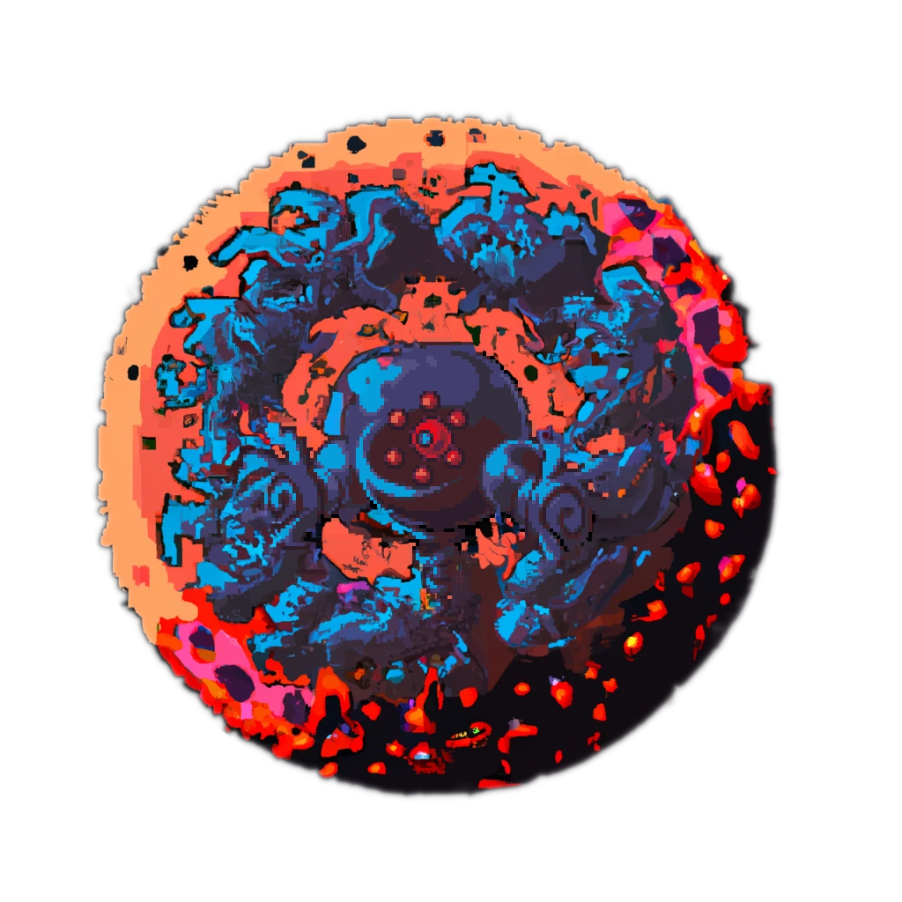

<hr>

<div align="center"> 
    
</div>

<div align="center"> 

### chalchiu

Modding support for Solar2D Games  

*Designed for [Coromon](https://store.steampowered.com/app/1218210/Coromon/)*

</div>

---

# Introduction

This Project aims to add mod support to [Coromon](https://store.steampowered.com/app/1218210/Coromon/) but is implemented in such a way that it should also work for other Solar2D Games.

# Usage

The installation of chalchiu is fairly simple:

* Locate your Game Folder
  > e.g. `C:/GOG Games/Coromon/`

* Rename the `CoronaLabs.Corona.Native.dll` to `orig.dll`
  > **Warning**  
  > This should only be done when you install chalchiu for the **first time**!  
  > **Ignore this step when updating!**

* Place the `CoronaLabs.Corona.Native.dll` found in the latest [Release](https://github.com/Curve/chalchiu/releases) into the same game directory

* Start the Game, the following things should happen:
  * A Log File named `chalchiu.txt` is created
  * A Folder named `mods` is created in the game directory
  * Your Game Window Title includes information about the loaded mods

# For Modders

<details><summary>Continue Reading...</summary>
<p>

## Example Mods

You can find some example mods in the [examples](./examples/) folder.  

A `dump_modules` mod is also included, which will dump all modules loaded by the game into the log.  
This is especially useful when you don't want to unpack the precompiled lua scripts the game uses, as just having information on the game modules is often enough to get started.

## Writing a Mod

Creating a mod is fairly simple.  

There are two types of mods, `hooks` and `scripts`, `hooks` are ran once a specified module is loaded, and `scripts` will just be run when loaded.

Regardless of wether or not your mod is a `hook` or a `script`, the following basic structure is required:

<table>
<tr>
<td>Basic Structure</td>
</tr>
<tr>
<td>

```lua
return {
  name        = 'Name', -- The name of your mod
  description = '....', -- The description of your mod
}
```

</td>
</tr>
</table>

Now, depending on what type of mod you wan't to write, the following fields are required:

* `hook`
  * target
    > The module you plan to intercept / modify
  * hook
    > The callback function that is ran once the specified module is loaded.  
    > The loaded `module` will be passed as the first parameter

* `script`
  * `script`
    > The function to be run on load


> **Warning**  
> The filename under which you save your mod is **important!**  
> Lua files in the `mods` directory will **only be loaded if** their filename ends on `mod.lua`

### Example Mod

<table>
<tr>
<td>example_mod.mod.lua</td>
</tr>
<tr>
<td>

```lua
return {
  name        = 'Name', -- The name of your mod
  description = '....', -- The description of your mod

  target      = 'classes.modules.playerCurrency', -- The module we want to intercept, can be obtained through the `dump_modules` mod.
  hook        = function (table)
      -- We now have full access to the module table
      local original = table.onLoadSaveslotData -- Save the original function
      
      -- Now we overwrite the `onLoadSaveslotData` function with our own, so that we can modify the amount of gold the player is holding.
      table.onLoadSaveslotData = function(self, data) 
        data.gold = 2^52
        return original(self, data)
      end
  end
}
```

</td>
</tr>
</table>


## Caveats

* When trying to `require` local files *(i.e. files you distribute along side the mod)*, you will have to use `req` instead of lua's built-in `require`.
* Using `req` may only work appropriately when called from inside the `hook` / `script` callback

</p>
</details>