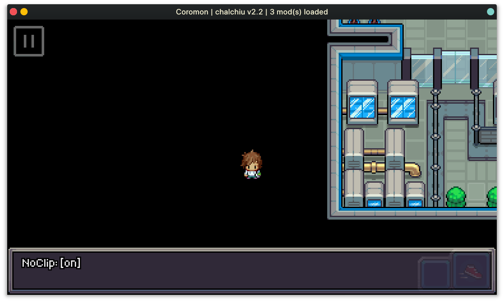
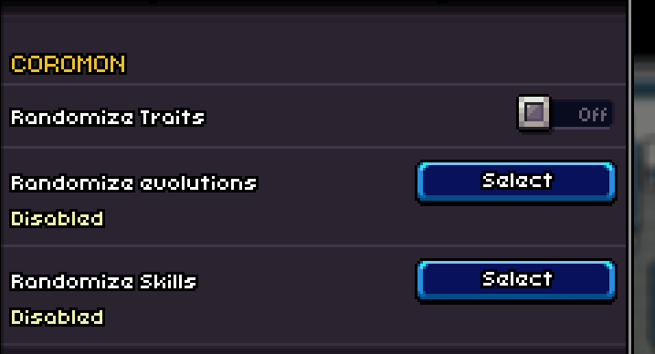
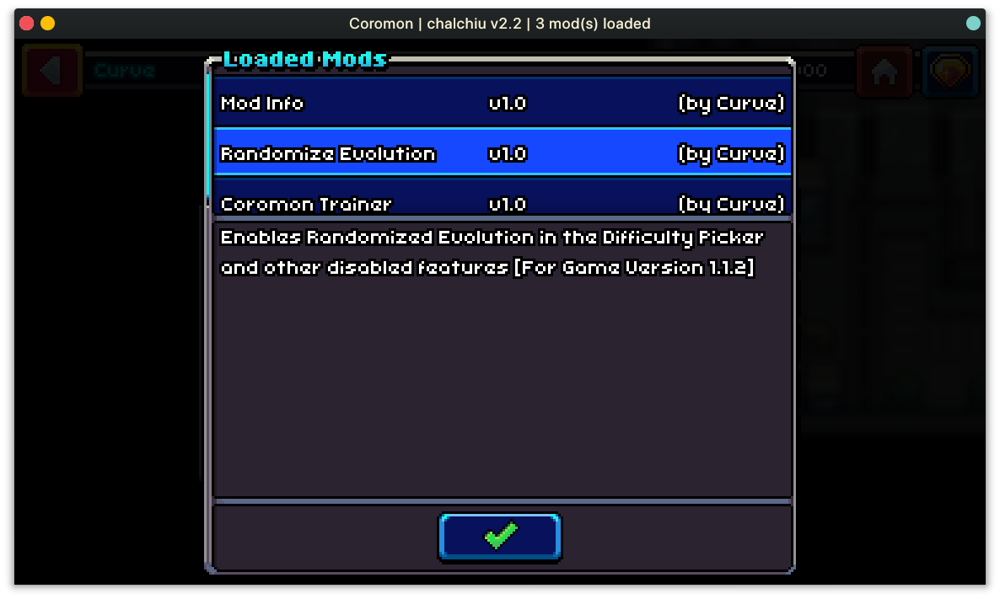

<hr>

<div align="center"> 
    
</div>

<div align="center"> 

### chalchiu

Modding support for Solar2D Games  

*Designed for [Coromon](https://store.steampowered.com/app/1218210/Coromon/)*

</div>

---

> **Warning**  
> Please do not report any issues that may've been caused through this project to the official game developers as they will not assist you with broken games / saves when you are using mods.  
> Please [open an issue here](https://github.com/Curve/chalchiu/issues/new) instead!

# Introduction

This Project aims to add mod support to [Coromon](https://store.steampowered.com/app/1218210/Coromon/) but is implemented in such a way that it should also work for other Solar2D Games.

# Usage

The installation of chalchiu is fairly simple:

* Locate your Game Folder
  > e.g. `C:/GOG Games/Coromon/`

* Download the zip file from the latest [Release](https://github.com/Curve/chalchiu/releases) and unpack all files into the game directory
  * Your Game Folder should now roughly look like this
    > Please note that some files have been omitted
    ```
    📂 C:/GOG Games/Coromon
    ├── coromon.exe
    ├── CoronaLabs.Corona.Native.dll
    ├── corona-plugins
    ├── iphlpapi.dll
    ├── libeay32.dll
    ├── lua.dll
    ├── mods
    ├── ...
    ```
* Start the Game, the following things should happen:
  * A Log File named `chalchiu.log` is created
  * A Folder named `mods` is created in the game directory
  * Your Game Window Title includes information about the loaded mods

# Coromon

<details><summary>Continue Reading...</summary>
<p>

Here you'll find information about the provided Coromon mods!  

All mods are tested with the latest game version <sub><sup>(v1.1.2 at the time of writing)</sup></sub>, don't let that stop you from trying them on other game versions though!

## Available Mods

- Trainer
  > A simple trainer, which allows you to fun things like noclip, max out all your coromon, and speed up the game!  
  >
  > When using the `Mod Info` mod, you can take a look at the available hotkeys in the mod list.
  

- Randomize Evolution
  > Brings back the "Randomize Evolution" Settings (and more!) in 1.1.2
   

- Mod Info
  > Shows information about the currently loaded mods, on game startup.  
  Also adds a button to the pause menu (top right corner), which allows you to bring up the menu again!
   

</p>
</details>

# For Modders

<details><summary>Continue Reading...</summary>
<p>

## Example Mods

You can find some example mods in the [scripts](./scripts) folder.  

A `debug` mod is also included, which will dump all modules loaded by the game into the log.  
This is especially useful when you don't want to unpack the precompiled lua scripts the game uses, as just having information on the game modules is often enough to get started.

## Writing a Mod

Creating a mod is fairly simple.  
All you need to do is create a folder for your mod and place an `init.lua` inside of it.

The `init.lua` **is the only file that is explicitly loaded** by chalchiu.  
You can however use `require` to load any files from the same directory your mod resides in.

You are expected to return a table containing some information about your mod from your `init.lua`.

<table>
<tr>
<td>(Example) init.lua</td>
</tr>
<tr>
<td>

```lua
require("hooks") -- Will load the `hooks.lua` residing in the same directory

return {
  name        = 'Name', -- The name of your mod
  author      = '....', -- Who wrote the mod?
  version     = '....', -- Current version of your mod
  description = '....', -- The description of your mod
}
```

</td>
</tr>
</table>

## Utilities

There are some utilities you can use from within your mod.

### Hooks

Hooks are an essential part of mods, as they allow you to modify modules loaded by the game as well as allowing you to dictate when a certain piece of code is run.

Hooks in chalchiu allow you to intercept lua `require` calls, which allows you to e.g. modify the original table and replace certain game logic with your own.

All you need is the name of a `module` you want to hook. _(To get a list of modules you can use the [debug mod](scripts/debug/))_

<table>
<tr>
<td>Registering a hook</td>
</tr>
<tr>
<td>

```lua
hooks.add("module.to.hook", function(table)
  -- `table` is the original table that would've been returned

  -- You can now fully alter the table, and e.g. overwrite some function:
  table["max"] = table["min"]
end)
```

</td>
</tr>
</table>

### Detours

The `detour` function allows you place a detour on any lua function and is often used together with [hooks](#hooks).

Detours can be useful for many things, e.g. modifying the players money when a save game is loaded.

<table>
<tr>
<td>Example Detour</td>
</tr>
<tr>
<td>

```lua
hooks.add("classes.localPlayer", function(table)
  detour(table, "getMoney", function(original, self, ...)
    -- `original` refers to the "original" (i.e. non detoured version) of the function
    local originalMoney = original(self, ...)
    return originalMoney * 1000
  end)
end)
```

</td>
</tr>
</table>

### Globals

Every mod is loaded in its own lua environment, thus it does not have write access to the global lua table.  

If you need explicit write access to the global table, you can use the `globals` variable, which refers to the global lua table used by the game.

> Most of the time you will not need this, however this can sometimes be useful, e.g. when you want to require one of the games files.

<table>
<tr>
<td>Simple Demonstration</td>
</tr>
<tr>
<td>

```lua
local not_math = require("math") -- This will fail as it will look for a `math.lua` inside of your mod!
local math = globals.require("math") -- This will load the same math as used by the game
```

</td>
</tr>
</table>


</p>
</details>